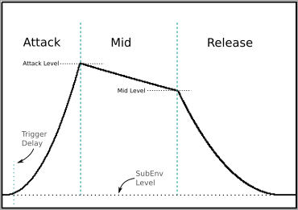

<!---
Markdown
-->

## vSwell

*vSwell* is a volume envelope audio effect plugin. The effect can be triggered by an audio signal, CV or a MIDI notein. 

The effect signal input is separate from the trigger signal input. This is *mostly* so alternative signal dynamics can act as a trigger (a fuzz can run through the effect, but the unboosted "clean" signal can be the trigger). However, other unrelated sounds can serve as the trigger, also.

Plugins are provided in LV2, VST, VST3 and CLAP formats, compiled for Linux environments. With a working hvcc environment, the patch *should* compile for other systems.

### Parameters

   * Attack Level
      * Signal level target value for the Attack envelope
   * Attack ms
      * Length of Attack portion of env, in milliseconds
   * Mid Level
      * Signal level target value for the Middle envelope
   * Mid ms
      * Length of the Middle portion of env, in milliseconds
   * Release ms
      * Length of Release, in milliseconds
   * Shape
      * The shape of the envelope
         * 1.0 is linear
         * less than 1.0 is convex
         * greater than 1.0 is concave
   * SubEnv Level
      * The mimimum "floor" signal level, "sub" or below the envelope
   * Threshold High
      * The effect triggers above this RMS db level
   * Threshold Low
      * db level BELOW the High Threshold where the effect resets for a new trigger
      * REPEAT: this value is *subtracted* from the Threshold High for the low threshold
   * Trigger Delay
      * Delay before an envelope begins, after a trigger event. A longer delay can reduce artifacts at the start of an envelope
   * Trigger EXT
      * An external trigger parameter, like a CV
   * Trigger by audio ON
      * If ON, the audio trigger is active. Turn this off if only an external or MIDI trigger is needed

### Envelope Terminology

vSwell uses the terms outlined on the graphic below for envelopes. The choice of terms is largely dictated by the Heavy (hvcc) compiler, as it only organizes parameters alphabetically.



### Inputs/Output

   * **Audio Input 1** : Audio Effect input
   * **Audio Input 2** : Audio Trigger input
   * **events-in** : MIDI Trigger input
   * **Audio Output 1** : Audio Output (mono)

(Port naming differs for different plugin formats. Above is the LV2 schema.)

### Tips

   * ANY MIDI noteon (with non-zero velocity) sent to the MIDI input port will trigger the envelope.

   * Release fades to the SubEnvelope level.

   * Setting the SubEnv Level above 0.1 and adjusting the envelope to slowly raise the level can create an effect similar to compression. It's not really compression *per se*, but it sounds cool (adding reverb also is cool).

   * The Shape parameter is exponential. When set to 1.0, the envelope curves are linear. Below 1.0, the curves are convex, above 1.0 they become concave (scooped):


**Warning!** 

Setting **Attack Level** and **Mid Level** above 1.0 AND the **Shape** parameter above 1.0 can lead to VERY high levels. There is a very simple 'safety' built in -- the output shouldn't exceed 2.5X the input.


### About vSwell

vSwell is based on a Pure Data patch, and built with the Heavy (hvcc) Pd compiler and the DISTRHO Plugin Framework.

This plugin was inspired by Pierre Massat's cool 'GuitarExtended' blog, circa 2012, specifically the "Bold As Love" patch. However, that patch doesn't encorporate a **schmitt trigger**, some form of which is *de rigueur* for audio-triggered FX.

Unfortunately, the Heavy compiler doesn't include [threshold~], so I included a custom *schmitt trigger* abstraction.

The Pd source patch is also included, and the plugin should build for any other OS that supports the "modern" version of hvcc (modern being support for python3).

   * [Miller Puckette and Pure Data](http://msp.ucsd.edu/index.htm)
   * [hvcc, the 'Heavy' Pd compiler](https://github.com/Wasted-Audio/hvcc)
      * Qudos to [dromer](https://github.com/dromer) for updating the original EnzienAudio code to python3
   * [DPF - DISTRHO Plugin Framework](https://distrho.github.io/DPF/index.html)

No effort has been made to integrate a fancy GUI for the plugin.

vSwell was written by Doug Garmon, and released under the MIT licence.

### Installing the prebuilds

The Releases section has a zip file with pre-built Linux plugin binaries. There's currently no installer, so just move the associated plugins to your home **.lv2**, **.vst**, and **.clap** directories. And the .vst3 directory as well, although I've not tested the VST3 version.

The build version (Makefile) includes a simple installation script, for local (user home) use.

### Building vSwell

- Install the **heavy** compiler:
```
$ pip3 install hvcc
```
Instructions for installing hvcc directly (not with the python installer) can be found on the repository (the link can be found above).

Clone the vSwell source (and the DISTHRO Plugin Framework):

```
git clone -recursive https://github.com/GModal/vSwell
```

Open a terminal (or cd to) the ChaffVerb directory, then enter:

`make`

There's a simple install option for local (single user) install:

`make install`

The plugin folders for each type must be present for install to work. These are named **.lv2**, **.vst**, and **.clap**, in your home directory. Each plugin can be manually copied to the local directories as well.
